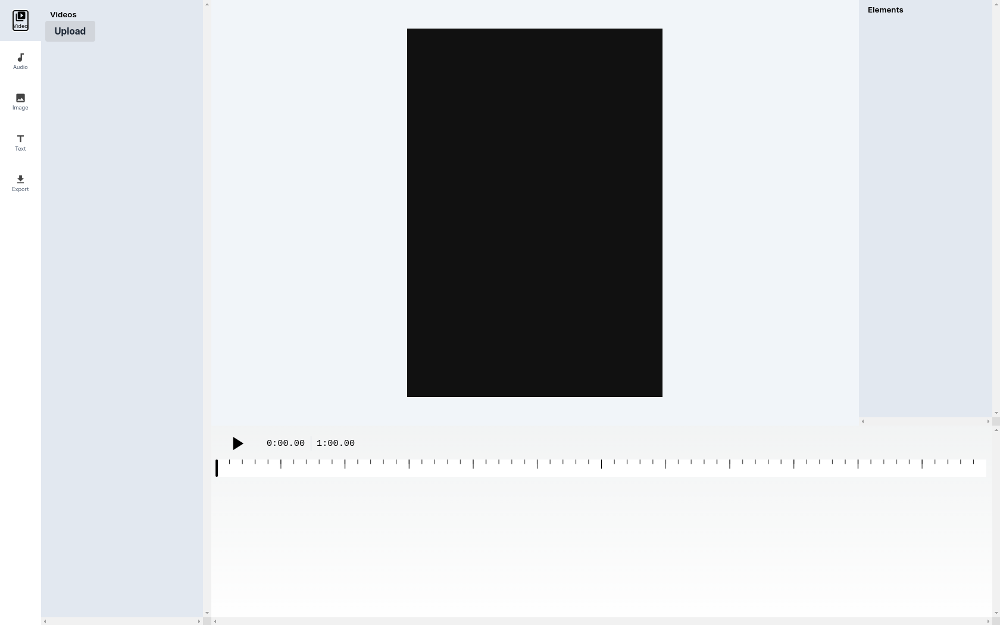

This was an hobby project developed by me. I will add support for other features in future. Looking for backend/ffmpeg developers to help in generating video from canvas in the backend.

Do you need a custom editor? Get in touch me at [Linked In](https://www.linkedin.com/in/arjun-computer-geek/)

Portfolio: [Website](https://arjun-computer-geek.github.io/) | [Twitter](https://x.com/arjun_comp_geek/) |

# Fabric Video Editor

Fabric Video Editor is a video editor that runs in the browser. It is built with fabric.js, Next.js (a React framework), Tailwindcss, Mobx, and typescript.

## Samples

### 1. New Updated UI



## Features

- [x] User can add
  - [x] Text
  - [x] Images
  - [x] Video
  - [x] Audio
- [x] Timeline
- [x] Export Video with Audio

## Main Issues

1. There might be problem in audio handling
2. Exported video doesnt have time duration
3. Exported video have flickering issue

## NextJs Default Guide (Updated)

This is a [Next.js](https://nextjs.org/) project bootstrapped with [`create-next-app`](https://github.com/vercel/next.js/tree/canary/packages/create-next-app).

### Getting Started

#### Setup

1. Clone the repo

2. Run the development server:

```bash
yarn run dev
```

3. Open [http://localhost:3000](http://localhost:3000) with your browser to see the result.

#### Debugging

1. Run the development server:

```bash
yarn run dev
```

2. Then run `Launch Chrome against localhost` in `Run and Debug` tab in VSCode

### Learn More

This project uses [`next/font`](https://nextjs.org/docs/basic-features/font-optimization) to automatically optimize and load Inter, a custom Google Font.

To learn more about Next.js, take a look at the following resources:

- [Next.js Documentation](https://nextjs.org/docs) - learn about Next.js features and API.
- [Learn Next.js](https://nextjs.org/learn) - an interactive Next.js tutorial.

You can check out [the Next.js GitHub repository](https://github.com/vercel/next.js/) - your feedback and contributions are welcome!
